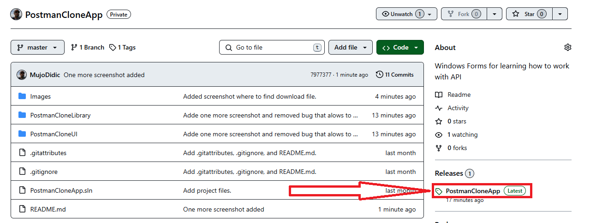

# PostmanCloneApp
Diese App ist ein Klon des Postman-Programms für den API-Zugriff und -Test.

## Sie wurde entwickelt mit
* C#
* .NET 8
* Windows Forms

### Zudem deckt sie die Verwendung von
* Klassenbibliotheken
* Schnittstellen (Interfaces)
* HttpClient
* JSON-Dateien

### und Methoden wie
* GET
* POST

## Verwendung der App
1. Laden Sie die ausführbare Datei herunter.

2. Wenn die App läuft, sollte sie so aussehen:

3. Nun kann der Benutzer den API-Link eingeben und die Schaltfläche „GO“ drücken.

### Geplante Erweiterungen
* Funktionalitäten wie POST, PUT, DELETE und PATCH
* API-Header
* API-Authentifizierung
* Dependency Injection
* Logging
* Erstellung der Benutzeroberfläche mit MAUI, WPF und Blazor
